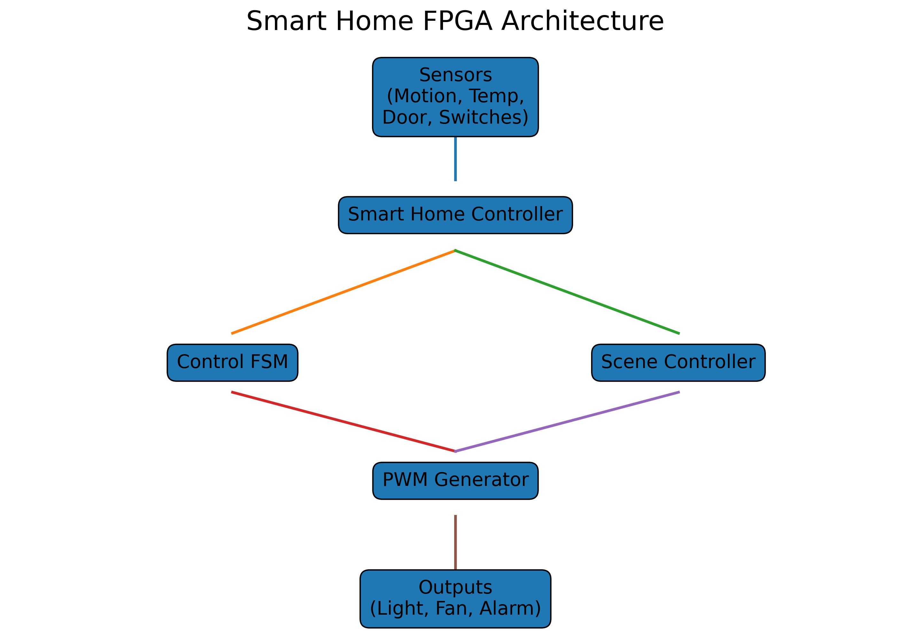
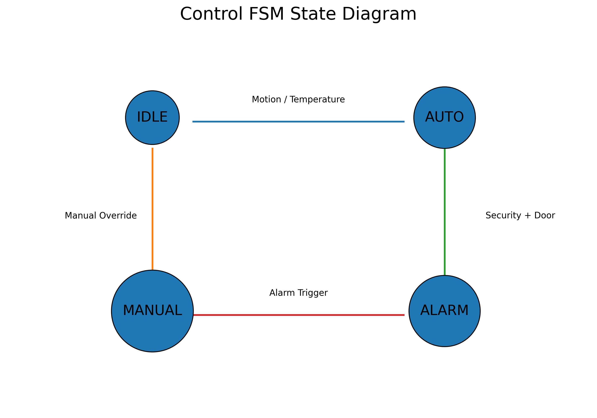
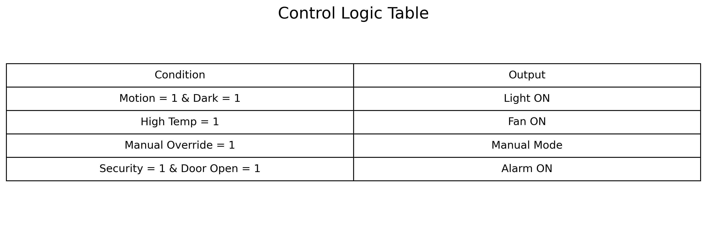
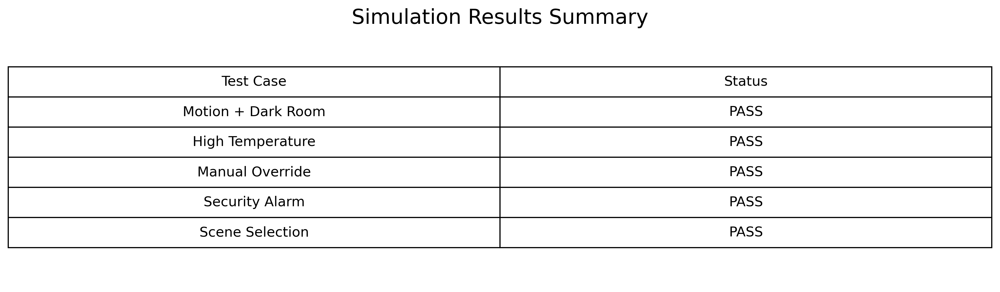

# 🏠 FPGA Smart Home Automation System

## 📌 Overview
This project implements a **Smart Home Automation System using FPGA and Verilog HDL**.  
It automates household appliances like lights, fans, and security systems using sensors, PWM control, FSM-based decision logic, and UART-based IoT communication.

The design follows a **modular RTL architecture** and is verified using simulation and waveform analysis.

---

## 🎯 Objective
To design an FPGA-based smart controller capable of:

- Automatic lighting control using PIR and LDR sensors
- PWM-based dimming and fan speed control
- Manual override system
- Scene-based automation presets
- Security alarm system with priority handling
- Energy-saving automation logic
- UART communication for IoT integration

---

## ⚙️ Features

- 💡 Smart lighting automation
- 🌬️ PWM fan control
- 🔐 Security alarm system
- 🎛️ Manual override mode
- 🧠 FSM-based control logic
- ⏱️ Clock-enable timing system
- 📡 UART IoT communication
- 🏡 Scene-based automation

---

## 🏗️ System Architecture

### 🔹 Block Diagram

---

## 🔄 FSM State Diagram

---

## 📊 Control Logic Table

---

## 📈 Simulation Results (Waveform)

---

## 📁 Project Structure

Smart-Home-Automation-FPGA/
│
├── rtl/
│   ├── clk_en.v
│   ├── debounce.v
│   ├── pwm8.v
│   ├── scenes.v
│   ├── ctrl_fsm.v
│   └── top.v
│
├── tb/
│   └── home_tb.v
│
├── images/
│   ├── smart_home_architecture.png
│   ├── fsm_state_diagram.png
│   ├── control_logic_table.png
│   └── simulation_results.png
│
├── simulation/
│   └── home.vcd
│
├── README.md
├── LICENSE
└── .gitignore

---

---

## 🧠 RTL Modules

| Module | Description |
|--------|------------|
| clk_en.v | Clock enable generator |
| debounce.v | Input debouncing & synchronization |
| pwm8.v | PWM generator (8-bit) |
| scenes.v | Scene preset logic |
| ctrl_fsm.v | Main control FSM |
| top.v | Top-level integration |

---

## 🔄 FSM Operation

The system operates in four modes:

- **MANUAL MODE** → User controls outputs directly  
- **SENSOR AUTO MODE** → Sensor-driven automation  
- **SCHEDULE MODE** → Time-based scene control  
- **ALARM MODE** → Emergency override (highest priority)

### Priority Order:

ALARM > MANUAL > SENSOR AUTO > SCHEDULE

---

## 🧪 Simulation Flow

### Tools Used:
- ModelSim / Vivado / Icarus Verilog  
- GTKWave for waveform analysis  

### Steps:
1. Compile RTL + Testbench  
2. Run simulation (`home_tb.v`)  
3. Generate `home.vcd`  
4. Open waveform in GTKWave  

---

## 📊 Expected Behavior

- Light turns ON when motion is detected in a dark environment  
- Fan speed varies based on control signals  
- Alarm triggers on emergency condition  
- Manual override disables automation logic  
- FSM transitions are visible in waveform

---

## 🚀 Future Improvements

- I2C sensor integration (temperature, humidity)  
- SPI ADC support for analog inputs  
- Mobile app control using MQTT  
- Power optimization modes  
- Formal verification using SystemVerilog Assertions (SVA)  

---

## 📚 Learning Outcomes

- FPGA RTL design workflow  
- FSM-based digital system design  
- PWM generation techniques  
- Sensor-based automation logic  
- Digital system verification  
- IoT communication basics

---

## 👨‍💻 Author

Ananya Jain

---

## 📜 License

This project is licensed under the MIT License.

## 📁 Project Structure
